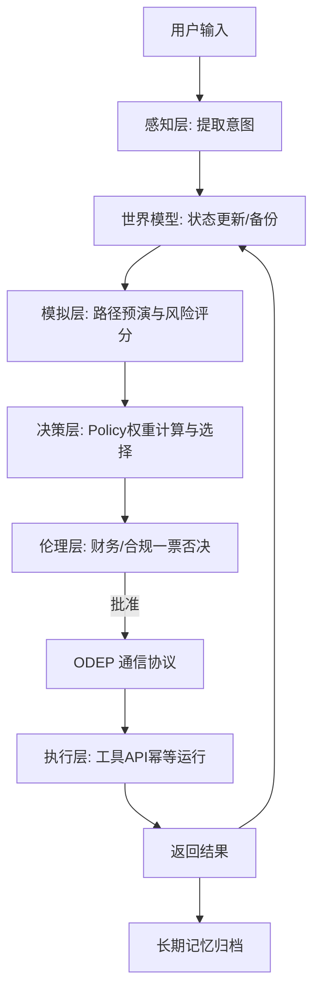

# Octopus 系统架构与设计说明书

## 1. 核心设计哲学

### 🧠 双系统慢思考范式
Octopus 的核心设计理念是将系统拆分为两个独立运作的层次：
- **决策层 (Decision Layer - Head / 慢思考)**：专注于“想”，负责理解意图、追踪世界状态、进行沙盘路径模拟、多标准评分以及安全/伦理边界审查。
- **执行层 (Execution Layer - Tentacles / 快思考)**：专注于“做”，仅以无状态的幂等方式执行工具 API，捕获错误并回传，绝不擅自做决定。

---

## 2. 神经元通信：ODEP 协议 (Octopus Decision Execution Protocol)
决策层与执行层可能物理隔离（例如脑子在云端大模型，执行手脚部署在本地边缘侧）。它们之间通过 **ODEP 协议** 进行异步或同步通信，核心报文格式如下：
*   `execute.request`：决策层向执行层下发结构化的 `ExecutionIntent` 指令。
*   `execute.response`：执行层回传 `ExecutionResult` 及执行结果。
*   `state.update`：状态同步事件，用于脑子实时感知手脚的世界变更。

---

## 3. 工作流执行顺序 (Data Flow)
1. **输入阶段**：Perception 转换用户自然语言为 Intent。
2. **状态记录**：World Model 记录全局目标及前置约束，并创建 `create_snapshot()` 存档。
3. **模拟预演**：Simulation Engine 虚拟试错，预估风险与成功率。
4. **决策取舍**：Decision Engine 基于 `DecisionCriteria` 权重对所有选项打分。
5. **风控拦截**：Ethics 结合伦理及风控准则审核，如果违规（如大额自动退款）直接触发 `block` 降级逻辑。
6. **手脚执行**：通过 ODEP 协议指派 Execution Layer 执行特定 Python 工具。
7. **总结归档**：执行成功则清理快照，并将经历写回 Long-Term Memory。若执行失败，World Model 触发 `restore_snapshot()` 回滚到存档状态。
