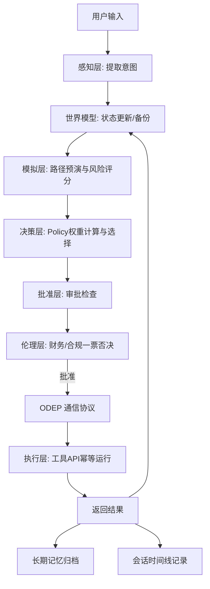
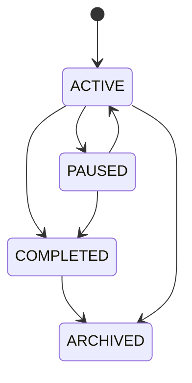
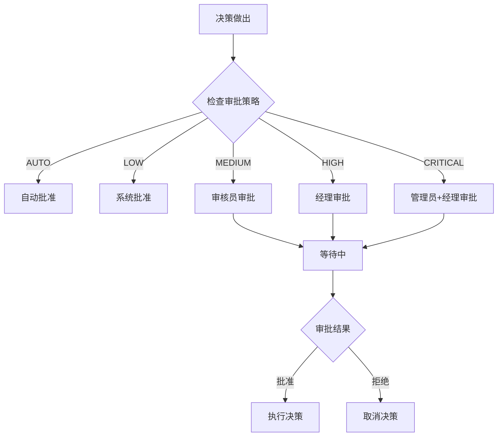

# Octopus 系统架构与设计说明书

## 1. 核心设计哲学

### 🧠 双系统慢思考范式
Octopus 的核心设计理念是将系统拆分为两个独立运作的层次：
- **决策层 (Decision Layer - Head / 慢思考)**：专注于“想”，负责理解意图、追踪世界状态、进行沙盘路径模拟、多标准评分以及安全/伦理边界审查。
- **执行层 (Execution Layer - Tentacles / 快思考)**：专注于“做”，仅以无状态的幂等方式执行工具 API，捕获错误并回传，绝不擅自做决定。



---

## 2. 系统架构全景图

```mermaid
graph TB
    subgraph 决策层 (Slow Thinking)
        direction LR
        subgraph 核心组件
            WorldModel[WorldModel]
            Perception[PerceptionModule]
            Simulation[SimulationEngine]
            Decision[DecisionEngine]
            Ethics[EthicsFramework]
            Memory[LongTermMemory]
        end
        
        subgraph 新增组件 (v0.3.x)
            Session[SessionStore]
            Approval[ApprovalManager]
            Card[DecisionCard]
            Comparator[DecisionComparator]
        end
        
        subgraph 工作区感知
            Workspace[LocalWorkspacePerceiver]
        end
    end
    
    subgraph 通信层
        ODEP[ODEP v1.0 Protocol]
        Transport[Transport Layer]
        Validator[JSON Schema Validator]
        Adapter[Protocol Adapter]
    end
    
    subgraph 执行层 (Fast Thinking)
        Executor[Execution Layer]
        Registry[Tool Registry]
    end
    
    核心组件 --> ODEP
    新增组件 --> ODEP
    工作区感知 --> ODEP
    ODEP --> 执行层
    
    Session --> Memory
    Approval --> Decision
    Card --> Decision
    Comparator --> Card
```

---

## 3. 神经元通信：ODEP 协议 (Octopus Decision Execution Protocol)

### 3.1 协议版本
- **ODEP v1.0**: 当前稳定版本，支持完整的消息类型和验证机制
- **向后兼容**: 通过协议适配器支持 ODEP v0 消息

### 3.2 消息类型
决策层与执行层可能物理隔离（例如脑子在云端大模型，执行手脚部署在本地边缘侧）。它们之间通过 **ODEP 协议** 进行异步或同步通信，核心报文格式如下：

| 消息类型 | 描述 |
|---------|------|
| `EXECUTION_REQUEST` | 决策层向执行层下发结构化的 `ExecutionIntent` 指令 |
| `EXECUTION_RESULT` | 执行层回传 `ExecutionResult` 及执行结果 |
| `WORLD_STATE_UPDATE` | 状态同步事件，用于脑子实时感知手脚的世界变更 |
| `APPROVAL_REQUEST` | 决策层向批准层发起批准请求 |
| `APPROVAL_RESPONSE` | 批准层回传批准结果 |
| `DECISION_REQUEST` | 请求决策服务 |
| `DECISION_RESPONSE` | 决策服务响应 |
| `ERROR` | 错误消息 |
| `PING/PONG` | 心跳检测 |

### 3.3 传输层
支持多种传输方式：
- **StdioTransport**: 标准输入输出（默认）
- **HTTP**: HTTP/HTTPS 协议
- **Message Queue**: 消息队列
- **RPC**: 远程过程调用

### 3.4 协议验证
使用 JSON Schema 进行消息格式验证，确保类型安全和消息格式正确性。

---

## 4. 工作区感知模块

### 4.1 设计目标
提供只读的工作区感知能力，让决策层能够了解当前工作环境状态，包括文件系统、Git仓库、网页内容等。

### 4.2 核心能力

| 功能 | 方法 | 说明 |
|------|------|------|
| 文件读取 | `read_file()` | 读取指定文件内容 |
| 目录扫描 | `repo_map()` | 生成目录结构树 |
| 内容搜索 | `search()` | 在文件中搜索关键词 |
| Git状态 | `git_status()` | 获取Git仓库状态 |
| Git差异 | `git_diff()` | 获取Git差异 |
| Git日志 | `git_log()` | 获取Git提交历史 |
| URL读取 | `read_url()` | 读取网页内容 |

### 4.3 预算控制
通过 `BudgetConfig` 控制资源访问限制：
- `max_files`: 最大文件数
- `max_chars_per_file`: 每个文件最大字符数
- `allowed_extensions`: 允许的文件扩展名
- `excluded_patterns`: 排除的文件模式

---

## 5. 会话管理系统

### 5.1 设计目标
管理决策会话的完整生命周期，支持会话的创建、切换、归档、搜索和时间线追踪。

### 5.2 会话状态



### 5.3 核心功能

| 功能 | 说明 |
|------|------|
| 创建会话 | 创建新的决策会话 |
| 切换会话 | 在不同会话间切换 |
| 归档会话 | 归档历史会话 |
| 搜索会话 | 按关键词搜索会话 |
| 时间线 | 查看会话事件时间线 |
| 当前会话 | 管理当前活跃会话 |

### 5.4 会话事件
- `session_started`: 会话开始
- `session_paused`: 会话暂停
- `session_resumed`: 会话恢复
- `session_completed`: 会话完成
- `session_archived`: 会话归档
- `decision_made`: 决策做出

---

## 6. 批准机制

### 6.1 设计目标
为决策流程提供审批控制，支持不同级别的审批策略，确保敏感操作需要人工确认。

### 6.2 审批级别

| 级别 | 说明 | 审批人 |
|------|------|--------|
| AUTO | 自动批准 | 无 |
| LOW | 低风险 | system |
| MEDIUM | 中风险 | reviewer |
| HIGH | 高风险 | manager |
| CRITICAL | 关键风险 | admin, manager |

### 6.3 审批流程



### 6.4 核心功能

| 功能 | 说明 |
|------|------|
| 创建审批 | 创建新的审批请求 |
| 批准 | 批准待审批请求 |
| 拒绝 | 拒绝待审批请求 |
| 列表 | 列出所有审批 |
| 待审批 | 列出待审批请求 |
| 状态检查 | 检查决策是否已批准 |
| 统计 | 审批统计信息 |

---

## 7. 决策卡片与比较

### 7.1 决策卡片
可视化决策结果，支持三种输出格式：
- **TEXT**: 纯文本格式
- **JSON**: 结构化JSON格式
- **RICH**: 富文本格式（表格、面板、高亮）

### 7.2 决策比较
对比多个决策结果，生成对比摘要：
- 总决策数
- 平均选项数
- 平均置信度
- 决策选择数量
- 平均选中分数
- 完成决策数

---

## 8. 工作流执行顺序 (Data Flow)

1. **输入阶段**：Perception 转换用户自然语言为 Intent。
2. **状态记录**：World Model 记录全局目标及前置约束，并创建 `create_snapshot()` 存档。
3. **会话管理**：SessionStore 创建/更新会话，记录事件时间线。
4. **模拟预演**：Simulation Engine 虚拟试错，预估风险与成功率。
5. **决策取舍**：Decision Engine 基于 `DecisionCriteria` 权重对所有选项打分。
6. **审批检查**：ApprovalManager 检查审批策略，等待人工审批（如需要）。
7. **风控拦截**：Ethics 结合伦理及风控准则审核，如果违规（如大额自动退款）直接触发 `block` 降级逻辑。
8. **决策渲染**：DecisionCard 渲染决策结果，支持多种格式输出。
9. **手脚执行**：通过 ODEP 协议指派 Execution Layer 执行特定 Python 工具。
10. **总结归档**：执行成功则清理快照，并将经历写回 Long-Term Memory 和 Session。若执行失败，World Model 触发 `restore_snapshot()` 回滚到存档状态。

---

## 9. 版本演进

### v0.1 - 基础架构
- 决策-执行层分离架构
- 核心组件定义（WorldModel, PerceptionModule, SimulationEngine, DecisionEngine, LongTermMemory, EthicsFramework）

### v0.2 - 协议标准化
- ODEP v1.0协议规范
- JSON Schema验证
- 传输层实现（StdioTransport）
- 向后兼容性（ODEPLegacyAdapter）

### v0.3 - 核心能力
- 工作区只读感知模块（LocalWorkspacePerceiver）
- 交互式CLI/TUI
- 决策卡片渲染（DecisionCardRenderer）

### v0.3.1 - 会话与批准
- 会话管理系统（SessionStore）
- 批准机制（ApprovalManager）
- 决策比较功能（DecisionComparator）